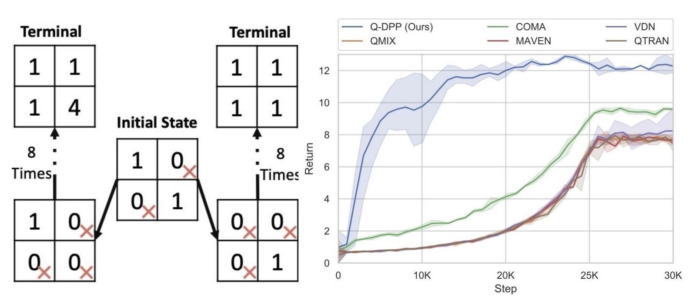
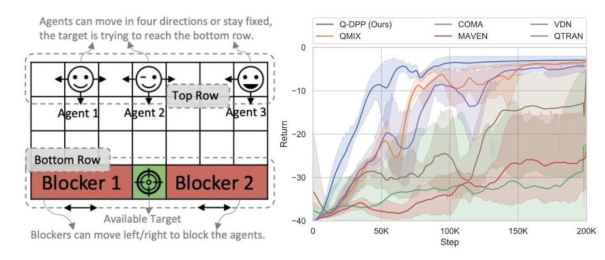
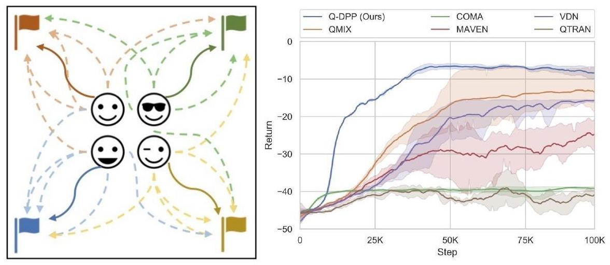
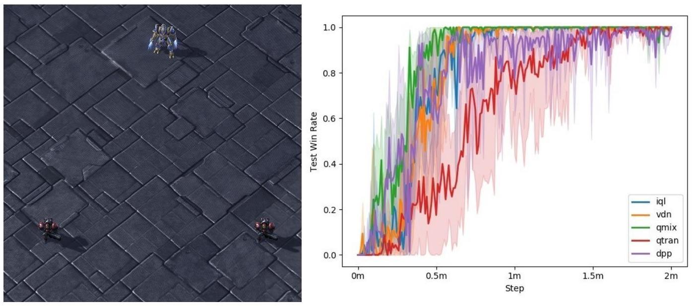

### What is Q-DPP
Q-DPP is a a novel extension of determinantal point process (DPP) to multi-agent setting. Q-DPP promotes agents to acquire diverse behavioral models; this allows a natural factorization of the joint Q-functions with no need for a priori structural constraints.


### How to run Q-DPP

- Setup the environment:

```bash
conda create -n dpp python=3.5
conda activate dpp
pip install -r requirements.txt
conda install matplotlib
conda develop add ./ma-gym
```

- Set up StarCraft II and SMAC:

```
cd pymarl
bash install_sc2.sh
```

- Run examples:

Here we provide example commands for quick test. Please refer to the next section for full reimplementation.

Run the experiment:

```python
cd ../pymarl
python src/main.py --config=qdpp --env-config=grid
python src/main.py --config=qmix --env-config=grid  with env_args.game_name=Spread-v0 
```

Run the experiments in parallel:
```bash
cd pymarl/scripts
bash head_run.sh
```


### How is Q-DPP working

We test Q-DPP on five different games against popular baseline models:

|              Game               |   State    |
| :-----------------------------: | :--------: |
|     Multi-Step Matrix Game      |  Discrete  |
|          Blocker Game           |  Discrete  |
|     Coordinated Navigation      |  Discrete  |
| Predator-Prey (2 vs 1 & 4 vs 1) |  Discrete  |
|     StarCraft II (2m_vs_1z)     | Continuous |

We present the executable commands for reproducibility and corresponding experimental performance:

- Multi-Step Matrix Game

```bash
python src/main.py --config=qdpp_nmatrix --env-config=nmatrix_idx with embedding_init=normal
```



- Blocker Game, Coordinated Navigation and Predator-Prey

```bash
bash run_exp3.sh
```

Blocker Game:



Coordinated Navigation:



Predator-Prey:


- StarCraft II

```bash
bash run_2m_vs_1z.sh
```



The result shows that our model is competitive with strong baselines. Note that Q-DPP is modified to a deep learning version, and more details can be found in [results_on_qdpp.pdf](results_on_qdpp.pdf). 

### Q&A:

- How can I find codes related to Q-DPP model? / Why do I only find `ma-gym` and `pymarl` packages? 

Q-DPP is based on [pymarl](https://github.com/oxwhirl/pymarl). We implement codes related to Q-DPP in `./pymarl/src/` with *qdpp* in their file names, including `./pymarl/src/controllers/qdpp_controller.py`, `./pymarl/src/learners/qdppq_learner.py` and  `./pymarl/src/modules/mixers/qdpp.py`.


- Why do my local codes fail to run?

Please check your environment, especially `ma-gym` package. Since we modified some parts of the package, please make sure that you installed `ma-gym` with the one that we provided. If you are testing on StarCraft environment, you can execute the following command in your terminal to check if SC2 is installed:

```bash
echo $SC2PATH
```

A valid directory is expected. Empirically, the provided codes should work well with PyTorch v1.4.0. Due to NVIDIA driver issues, it is still possible to see incompatible datatype errors raised. We recommend to check if data are copied to correct devices via commands like `.cuda()` or `.cpu()`. 